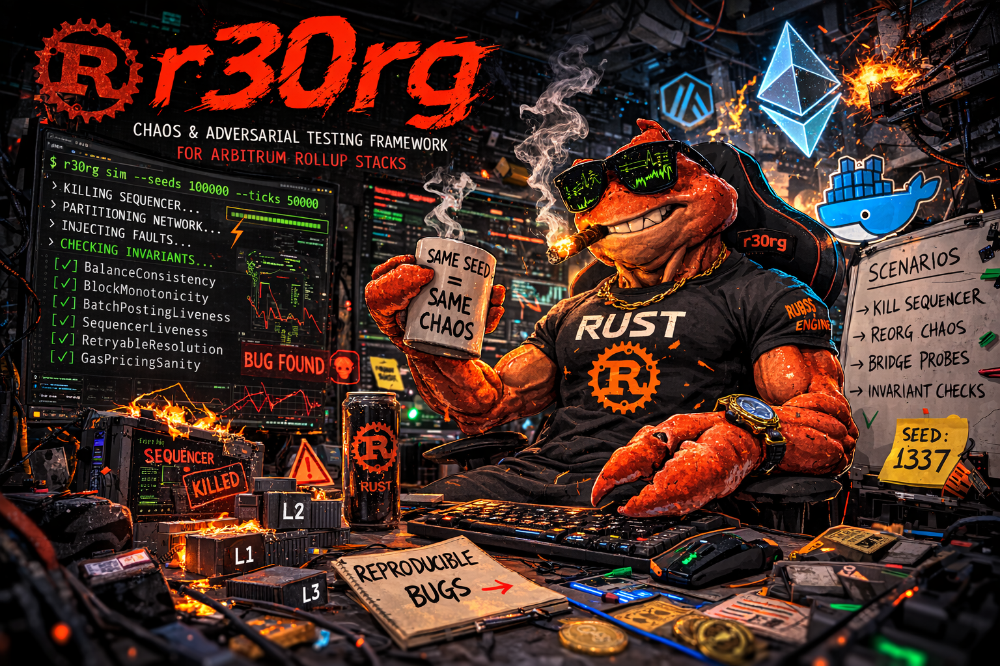

<p align="center">
  
</p>

<h1 align="center">r30rg</h1>

<p align="center">
  <strong>Chaos & adversarial testing framework for Arbitrum rollup stacks.</strong><br/>
  Same seed = same chaos = reproducible bugs.
</p>

<p align="center">
  <a href="#live-scenarios"></a>
  <a href="#deterministic-simulation"></a>
  <a href="#cli-reference"></a>
  <a href="LICENSE"></a>
</p>

---

## Overview

**r30rg** is a Rust-based chaos engineering framework purpose-built for the [Arbitrum Nitro](https://github.com/OffchainLabs/nitro) rollup stack. It operates in two tiers:

| Tier | Command | What It Does | Infra Needed |
|------|---------|-------------|--------------|
| **Live Chaos** | `r30rg run` | Hits a running nitro-testnode via Docker API + Ethereum RPC. Kills containers, injects partitions, probes invariants across L1/L2/L3. | Docker stack |
| **Simulation** | `r30rg sim` | Deterministic, time-compressed model of the full rollup stack (L1 + L2 sequencer/poster/validator + L3 Orbit). Millions of seeds, invariant checking every tick, bridge messaging, retryable tickets. | None |

## Architecture

```text
r30rg/
├── crates/
│   ├── r30rg-core/       # Types, traits, PRNG (ChaCha20), simulated clock, invariants
│   ├── r30rg-sim/        # Deterministic simulation engine (TigerBeetle-style)
│   ├── r30rg-live/       # Live chaos: Docker fault injection (Bollard) + RPC harness (Alloy)
│   ├── r30rg-scenarios/  # Adversarial scenario library (6 scenarios)
│   └── r30rg-cli/        # CLI binary (text + JSON output)
├── media/                # Assets (hero image)
├── Cargo.toml            # Workspace manifest
├── LICENSE               # MIT
└── README.md
```

## Quick Start

```bash
# Build
cargo build --release

# Check connectivity to running nitro-testnode
r30rg ping

# List all available scenarios
r30rg list

# Run all non-destructive probes
r30rg run all --non-destructive

# Run a specific destructive scenario
r30rg --seed 42 run sequencer-kill-and-recover

# Run deterministic simulation (10k seeds x 5k ticks)
r30rg sim --seeds 10000 --ticks 5000

# JSON output (for CI / pipelines)
r30rg --output json run all --non-destructive
r30rg --output json sim --seeds 1000 --ticks 5000
```

## Live Scenarios

Six adversarial scenarios targeting the Arbitrum Nitro testnode stack:

| Scenario | Category | Destructive | Layers | What It Tests |
|----------|----------|:-----------:|:------:|---------------|
| `sequencer-kill-and-recover` | sequencer-chaos | Yes | L1, L2 | Kill L2 sequencer, verify L1 unaffected, restart, verify L2 recovery |
| `batch-poster-kill-and-recover` | sequencer-chaos | Yes | L1, L2 | Kill batch poster, verify sequencer keeps producing blocks, restart, verify batches resume |
| `validator-kill-and-recover` | sequencer-chaos | Yes | L1, L2 | Kill validator, verify sequencer + poster unaffected, restart, verify assertions resume |
| `balance-consistency-probe` | bridge-adversarial | No | L1, L2, L3 | Snapshot balances on all layers, verify cross-layer consistency, probe precompiles |
| `full-stack-health-probe` | invariant-probe | No | L1, L2, L3 | Block production liveness, gas pricing sanity, precompile accessibility, cross-layer connectivity |
| `precompile-surface-probe` | invariant-probe | No | L2 | Probe ArbSys, ArbGasInfo, ArbRetryableTx, ArbAggregator precompiles; verify valid responses |

### Filtering

```bash
# Only non-destructive scenarios
r30rg run all --non-destructive

# Only a specific category
r30rg run all --category sequencer-chaos

# Combine filters
r30rg run all --category invariant-probe --non-destructive
```

## Deterministic Simulation

Inspired by [TigerBeetle's VOPR](https://tigerbeetle.com/blog/2023-07-11-a-]friendly-abstraction-over-iouring-and-kqueue/) — deterministic simulation testing that compresses years of operation into minutes.

### Simulated Components

| Component | Role |
|-----------|------|
| **L1** | Base layer, always-on block production, fluctuating gas price |
| **L2 Sequencer** | On-demand block production, tx generation, gas price tracking |
| **L2 Batch Poster** | Periodic batch posting to L1 with cost accounting |
| **L2 Validator** | Periodic assertion posting with staking cost |
| **L3 Sequencer** | Orbit chain block production, independent gas model |

### Simulated Mechanics

- **Bridge messaging** — L1 to L2, L2 to L1 (with challenge period), L2 to L3 deposits
- **Retryable tickets** — 30% of L1 to L2 deposits are retryable, auto-redeemed after delivery
- **Gas price modeling** — per-layer fluctuation with floors
- **Fault injection** — random node crashes (0.1%/tick), network partitions (0.05%/tick), scheduled restarts
- **Simulated network** — configurable latency, message loss, reordering, partitions

### 8 Invariants Checked Every Tick

| # | Invariant | What It Catches |
|---|-----------|----------------|
| 1 | **L1 Liveness** | L1 must always produce blocks |
| 2 | **Sequencer Liveness** | L2 sequencer must not permanently stall |
| 3 | **Batch Posting** | Batch poster must post within 200 ticks |
| 4 | **Validator Assertions** | Validator must assert within 500 ticks |
| 5 | **L3 Liveness** | L3 Orbit sequencer must produce blocks when alive |
| 6 | **Gas Price Sanity** | No node's gas price may drop to zero |
| 7 | **Retryable Resolution** | No more than 5 retryable tickets stuck >100 ticks |
| 8 | **Bridge Accounting** | Total deposited across nodes must never exceed total sent |

### Performance

```text
$ r30rg sim --seeds 10000 --ticks 5000

Campaign complete in 40.72s
Seeds:  10000 run, 9999 passed, 1 failed
Ticks:  50000000 total (1,250,000 ticks/sec)
```

50 million ticks of simulated rollup operation in ~41 seconds.

### Determinism Guarantee

Same seed always produces the exact same fault sequence and invariant results:

```rust
let mut a = Simulator::new(1337);
let mut b = Simulator::new(1337);
assert_eq!(a.run(1000).violations.len(), b.run(1000).violations.len());
```

## Chaos Profiles

| Profile | Pause Rate | Kill Rate | Partition Rate | Target L1 |
|---------|:----------:|:---------:|:--------------:|:---------:|
| `gentle` | 0.1% | 0% | 0.05% | No |
| `moderate` | 0.5% | 0.1% | 0.2% | No |
| `apocalyptic` | 2% | 0.5% | 1% | Yes |

```bash
r30rg profiles   # Show all profiles with details
```

## CLI Reference

```text
r30rg — chaos & adversarial testing for Arbitrum rollup stacks

USAGE:
    r30rg [OPTIONS] <COMMAND>

COMMANDS:
    list       List all available scenarios
    run        Run scenario(s) against the live stack
    sim        Run deterministic simulation campaign
    profiles   Show chaos profiles
    ping       Check connectivity to the live stack

GLOBAL OPTIONS:
    --seed <N>           Deterministic RNG seed (default: 1337)
    --log-level <LEVEL>  Log level: trace|debug|info|warn|error (default: info)
    --output <FORMAT>    Output format: text|json (default: text)

RUN OPTIONS:
    --category <CAT>     Filter by category (e.g. "sequencer-chaos")
    --non-destructive    Only run non-destructive scenarios
    --l1-rpc <URL>       L1 RPC endpoint (default: http://127.0.0.1:8545)
    --l2-rpc <URL>       L2 RPC endpoint (default: http://127.0.0.1:8547)
    --l3-rpc <URL>       L3 RPC endpoint (default: http://127.0.0.1:3347)
    --docker-project <N> Docker compose project (default: nitro-testnode-live)

SIM OPTIONS:
    --seeds <N>          Number of seeds to run (default: 1000)
    --ticks <N>          Ticks per seed (default: 10000)
```

### JSON Output

All commands support `--output json` for CI/pipeline integration:

```bash
# Structured scenario results
r30rg --output json run all --non-destructive

# Structured simulation results
r30rg --output json sim --seeds 1000 --ticks 5000

# Structured scenario list
r30rg --output json list
```

## Requirements

- **Rust** 1.80+
- **Docker** (for live chaos mode only)
- **Arbitrum nitro-testnode** (for live chaos mode only) — [setup guide](https://docs.arbitrum.io/run-arbitrum-node/nitro/build-nitro-locally)

### Target Stack

| Service | Port | Chain ID |
|---------|:----:|:--------:|
| L1 geth (dev mode) | 8545 | 1337 |
| L2 sequencer | 8547 | 412346 |
| L2 batch poster | 8147 | — |
| L2 validator | 8247 | — |
| L3 Orbit node | 3347 | 333333 |

## License

[MIT](LICENSE)
